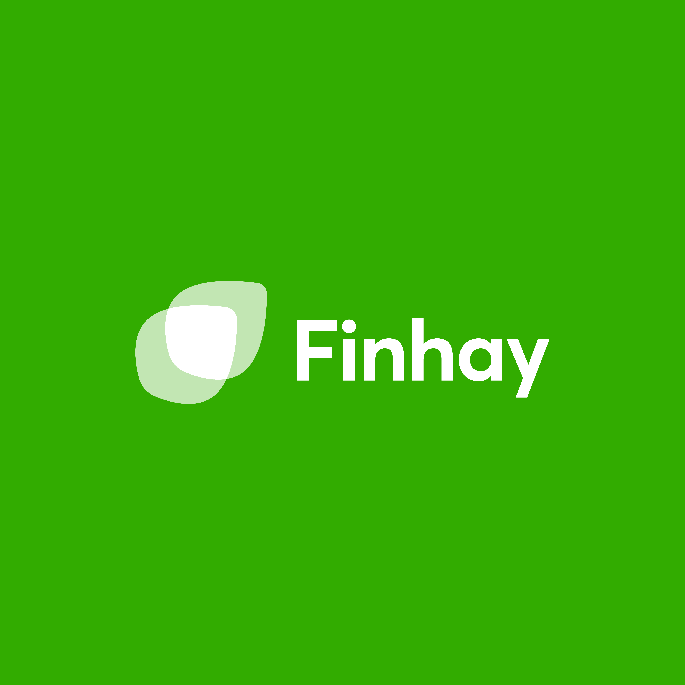

# Finhay Logo Guidelines

Complete specifications for using the Finhay logo correctly across all applications.

---

## ⛔ CRITICAL: Use Exact Logo Files Only

> **NEVER recreate, redraw, code, or generate the Finhay logo.**
>
> The Finhay logo contains precise gradients, overlapping transparencies, and exact proportions that CANNOT be accurately reproduced by:
> - Drawing with code (SVG, CSS shapes, Canvas, etc.)
> - AI image generation
> - Unicode/emoji substitutes (🍃, 🌿, etc.)
> - Manual recreation in any form
>
> **You MUST use the exact PNG files provided in `assets/logos/`.**

### Required Action

When you need to display the Finhay logo, you MUST:

1. **Reference the actual file** from `assets/logos/`
2. **Embed or link** to the PNG file directly
3. **Choose the correct variant** based on background color

### Implementation Examples

**HTML (using CDN):**
```html

```

**HTML (using local file):**
```html

```

**Markdown:**
```markdown

```

**React/Next.js:**
```jsx
<Image src="https://cdn1.finhay.com.vn/vnsc-prod/general/tuan.tran-1768011497755-hu6hdzzpk-finhay-horizontal-green.png" alt="Finhay" width={120} height={40} />
```

**CSS Background:**
```css
.header-logo {
  background-image: url('https://cdn1.finhay.com.vn/vnsc-prod/general/tuan.tran-1768011497755-hu6hdzzpk-finhay-horizontal-green.png');
  background-size: contain;
  background-repeat: no-repeat;
}
```

**Tailwind CSS:**
```html

```

---

## Logo Structure

### Components

The Finhay logo consists of two integrated elements:

| Component | Description |
|-----------|-------------|
| **Symbol** | Two overlapping organic leaf shapes at 45° angle |
| **Wordmark** | "Finhay" in Inter Bold typeface |

These elements must always appear together in approved configurations.

### Logo Formats

| Format | Description | Primary Use |
|--------|-------------|-------------|
| **Horizontal** | Symbol left, wordmark right | Headers, wide spaces, primary usage |
| **Vertical** | Symbol above, wordmark below | Square spaces, app icons, avatars |

## Logo Meaning & Symbolism

### The Two Leaves

Like a small seedling, the two leaves represent something small but valuable and full of potential. This mirrors the investment philosophy: small, consistent investments grow over time into significant value.

### The 45° Angle

The leaves combine at a 45° angle (matching an XY growth chart). The number two represents balanced speed—not too slow (1), not too fast (3)—symbolizing harmonious, stable, sustainable growth.

### The Color Green

Green represents vitality, enthusiasm, and trust. It's the core color representing Finhay's spirit and values, also symbolizing growth and prosperity in Vietnamese culture.

| Element | Symbolism |
|---------|-----------|
| Two leaves | Growth potential, nurturing investments |
| Overlapping shape | Synergy, compound growth |
| 45° angle | Balanced, sustainable growth trajectory |
| Green color | Vitality, trust, prosperity |

## Logo Colors

### Full Color Version (Primary)

| Element | Hex | Description |
|---------|-----|-------------|
| Leaf 1 (front/bright) | `#4CD137` | Bright green, main leaf |
| Leaf 2 (back/light) | `#8BE379` | Light green, supporting leaf |
| Overlap area | `#3DAD26` | Medium green, intersection |
| Wordmark (light bg) | `#000000` | Black on light backgrounds |
| Wordmark (dark bg) | `#FFFFFF` | White on dark backgrounds |

### Monochrome Versions

| Version | Usage | Colors |
|---------|-------|--------|
| **Black** | Light backgrounds, B&W print | All elements `#000000` |
| **White** | Dark backgrounds, reversed | All elements `#FFFFFF` |
| **Single color** | Limited color printing | One approved brand color |

### Inverse/Reversed Version

For dark backgrounds, the logo adapts:
- Symbol: Uses lighter green tints (`#8BE379`, `#D9F5D3`) with white core
- Wordmark: White (`#FFFFFF`)

## Minimum Sizes

To ensure legibility and visual integrity:

| Application | Minimum Width |
|-------------|---------------|
| Digital (web, app, social) | 80px |
| Print (brochures, cards) | 20mm |
| Large format (banners, signage) | Proportional to viewing distance |

Below these sizes, consider using the symbol alone (without wordmark).

## Logo Placement

### Preferred Positions (Priority Order)

1. **Top-left corner** ⭐ Primary/default position
2. Top-center
3. Top-right
4. Bottom-left
5. Bottom-right
6. Center (for hero/splash screens only)

### Placement Guidelines

```
┌──────────────────────────────────┐
│ 🍃 Logo                          │  ← Preferred
│                                  │
│                                  │
│                                  │
│                                  │
│                                  │
└──────────────────────────────────┘

┌──────────────────────────────────┐
│         🍃 Logo                  │  ← Acceptable
│                                  │
└──────────────────────────────────┘

┌──────────────────────────────────┐
│                                  │
│                                  │
│           🍃 Logo                │  ← Hero/Splash only
│                                  │
│                                  │
└──────────────────────────────────┘
```

## Background Usage

### Approved Backgrounds

| Background | Logo Version | Notes |
|------------|--------------|-------|
| White / Light neutral | Full color (black wordmark) | Primary usage |
| Brand Green (`#298C1B`) | White/light symbol + white wordmark | Inverse version |
| Dark Green (`#1E5613`) | Full color symbol + white wordmark | Premium contexts |
| Black | White logo or full color + white wordmark | Dark mode |
| Light Green tints | Full color (black wordmark) | Subtle backgrounds |
| Photography (simple) | Use version with best contrast | Ensure readability |

### Backgrounds to Avoid

❌ **Never place logo on:**
- Complex patterns or busy images
- Low contrast colors (similar greens)
- Clashing colors (red, orange backgrounds)
- Gradients that reduce readability
- Textured surfaces that obscure details

### Photography Guidelines

When placing logo over photos:
1. Choose areas with minimal detail
2. Use solid overlay if needed (semi-transparent white or dark)
3. Ensure minimum contrast ratio of 4.5:1
4. Test at actual size for readability

## Logo Don'ts

### ❌ Never Do These:

| Don't | Why |
|-------|-----|
| **Recreate or redraw the logo** | ⛔ **CRITICAL** - Always use exact PNG files from `assets/logos/` |
| **Draw with code (SVG/CSS/Canvas)** | ⛔ Cannot reproduce exact gradients and proportions |
| **Use emoji/unicode as substitute** | ⛔ 🍃🌿 are NOT acceptable logo replacements |
| **Generate with AI tools** | ⛔ AI cannot replicate the exact brand assets |
| **Change colors** | Breaks brand recognition |
| **Stretch or distort** | Damages proportions |
| **Add effects** (shadows, glows, outlines) | Clutters the design |
| **Change the typeface** | Inter Bold is specified |
| **Separate symbol from wordmark** | They work as a unit |
| **Place on busy backgrounds** | Reduces visibility |
| **Rotate the logo** | Disrupts the 45° symbolism |
| **Add elements to logo** | Alters brand identity |
| **Use outdated versions** | Only 2025 logo is valid |
| **Apply patterns/textures** | Keeps logo clean |
| **Crop the logo** | Full logo must be visible |

### Visual Examples

```
✗ Wrong: Different colors
   🍃 Finhay (in blue, red, etc.)

✗ Wrong: Stretched
   🍃🍃🍃 Finhay (horizontally stretched)

✗ Wrong: Effects added
   [Shadow] 🍃 Finhay [Glow]

✗ Wrong: Separated elements
   🍃
   
   Finhay

✗ Wrong: Rotated
   ↗️ 🍃 Finhay (at an angle)
```

## Brand Naming Convention

### Naming New Entities

When creating new brands within the Finhay ecosystem, follow these patterns:

#### Companies, Projects, Platforms
**Pattern**: `Finhay` + `[Descriptive Suffix]`

| Example | Type |
|---------|------|
| Finhay Commodities | Company |
| Finhay Securities | Company (VNSC rebranding Jan 2026) |
| Finhay Holding | Company |
| Finhay Invest | Platform |
| Finhay Trading | Platform |
| Finhay Careers | Project |
| Finhay Esports | Project |

#### Products, Teams, Mascots
**Pattern**: `Hay` + `[Creative Suffix]`

| Example | Type |
|---------|------|
| HayBond | Product (bonds) |
| HayBuddy | AI Assistant |
| HayMate | Team mascot |
| HayTheMoon | Esports team |
| HayInsights | Data service |
| HayFund | Product (funds) |
| HayProtect | Product (insurance) |

### Brand Architecture

```
Finhay (Parent Brand)
│
├── HayInsights (Data Service)
│
├── VNSC by Finhay (Securities)
│   └── → Finhay Securities (January 2026)
│
└── HayTheMoon Esport (Gaming/Esports)
```

### Sub-brand Logo Treatment

Sub-brands may have their own visual identity but must:
1. Reference parent Finhay brand clearly
2. Use "by Finhay" or "Finhay" in the name
3. Maintain color family consistency
4. Follow overall brand guidelines

## Logo File Formats

### Available Formats

| Format | Usage |
|--------|-------|
| `.png` | Digital, web, presentations (transparent background) |
| `.jpg` | Digital where transparency not needed |
| `.svg` | Scalable digital, web development |
| `.pdf` | Print, vector quality |
| `.ai` / `.eps` | Professional print, editing |

## Logo Asset Files

### Available Formats

Logo files are available both locally and via CDN. **Use CDN URLs for web/online content** for better performance.

### Logo Assets with CDN URLs

| Variant | Local Path | CDN URL |
|---------|------------|---------|
| **Horizontal Green** | `assets/logos/finhay-horizontal-green.png` | `https://cdn1.finhay.com.vn/vnsc-prod/general/tuan.tran-1768011497755-hu6hdzzpk-finhay-horizontal-green.png` |
| **Horizontal Dark Green** | `assets/logos/finhay-horizontal-dark-green.png` | `https://cdn1.finhay.com.vn/vnsc-prod/general/tuan.tran-1768011497759-y5cwflmdu-finhay-horizontal-dark-green.png` |
| **Horizontal White** | `assets/logos/finhay-horizontal-white.png` | `https://cdn1.finhay.com.vn/vnsc-prod/general/tuan.tran-1768011497762-e3ft5wg9q-finhay-horizontal-white.png` |
| **Horizontal Black Text Transparent** | `assets/logos/finhay-horizontal-black-text-transparent.png` | `https://cdn1.finhay.com.vn/vnsc-prod/general/tuan.tran-1768011497742-ogr49nb6f-finhay-horizontal-black-text-transparent.png` |
| **Horizontal White Text Transparent** | `assets/logos/finhay-horizontal-white-text-transparent.png` | `https://cdn1.finhay.com.vn/vnsc-prod/general/tuan.tran-1768011497758-pll3l5jik-finhay-horizontal-white-text-transparent.png` |
| **Vertical Green** | `assets/logos/finhay-vertical-green.png` | `https://cdn1.finhay.com.vn/vnsc-prod/general/tuan.tran-1768011498429-tz3yrqk85-finhay-vertical-green.png` |
| **Vertical Dark Green** | `assets/logos/finhay-vertical-dark-green.png` | `https://cdn1.finhay.com.vn/vnsc-prod/general/tuan.tran-1768011498425-ufrb1ah16-finhay-vertical-dark-green.png` |
| **Vertical White** | `assets/logos/finhay-vertical-white.png` | `https://cdn1.finhay.com.vn/vnsc-prod/general/tuan.tran-1768011498466-nvg09d5fu-finhay-vertical-white.png` |
| **Vertical Black Text Transparent** | `assets/logos/finhay-vertical-black-text-transparent.png` | `https://cdn1.finhay.com.vn/vnsc-prod/general/tuan.tran-1768011498226-q75xvkaqg-finhay-vertical-black-text-transparent.png` |
| **Vertical White Text Transparent** | `assets/logos/finhay-vertical-white-text-transparent.png` | `https://cdn1.finhay.com.vn/vnsc-prod/general/tuan.tran-1768011498433-5h5aly187-finhay-vertical-white-text-transparent.png` |
| **Symbol Green** | `assets/logos/finhay-symbol-green.png` | `https://cdn1.finhay.com.vn/vnsc-prod/general/tuan.tran-1768011498216-n1n8epy32-finhay-symbol-green.png` |
| **Symbol Dark Green** | `assets/logos/finhay-symbol-dark-green.png` | `https://cdn1.finhay.com.vn/vnsc-prod/general/tuan.tran-1768011498211-w39dc8beq-finhay-symbol-dark-green.png` |
| **Symbol White** | `assets/logos/finhay-symbol-white.png` | `https://cdn1.finhay.com.vn/vnsc-prod/general/tuan.tran-1768011498222-ptzu8uklu-finhay-symbol-white.png` |
| **Symbol Transparent** | `assets/logos/finhay-symbol-transparent.png` | `https://cdn1.finhay.com.vn/vnsc-prod/general/tuan.tran-1768011498221-6ck6dkgwv-finhay-symbol-transparent.png` |

### Quick Selection Guide

```
Light background (white, light gray, light green)?
├── Need full logo? → finhay-horizontal-green.png
├── Square space?   → finhay-vertical-green.png
└── Icon only?      → finhay-symbol-green.png

Dark background (dark green, black, brand green)?
├── Need full logo? → finhay-horizontal-white.png
├── Square space?   → finhay-vertical-white.png
└── Icon only?      → finhay-symbol-white.png

Transparent overlay needed?
├── Black text version → finhay-horizontal-black-text-transparent.png
├── White text version → finhay-horizontal-white-text-transparent.png
└── Symbol only → finhay-symbol-transparent.png
```

### Background Assets

Located in `assets/backgrounds/`:

| File | Path | Description |
|------|------|-------------|
| **Gradient 01** | `assets/backgrounds/gradient-01.jpg` | Light-to-green gradient, top-down |
| **Gradient 02** | `assets/backgrounds/gradient-02.jpg` | Green-to-dark gradient, top-down |
| **Gradient 03** | `assets/backgrounds/gradient-03.jpg` | Light fade gradient, subtle |

### Logo + Background Combinations

| Background File | Recommended Logo |
|-----------------|------------------|
| `gradient-01.jpg` (light top) | `finhay-horizontal-green.png` at top |
| `gradient-02.jpg` (dark bottom) | `finhay-horizontal-white.png` at bottom |
| `gradient-03.jpg` (light) | `finhay-horizontal-green.png` |

### Original Source Files

The curated assets above are derived from the full logo package:

```
Logo_Finhay_2025_Pakage[XX].png (where XX = 01-17)
```

| Original File | Maps To |
|---------------|---------|
| Pakage01 | finhay-horizontal-green.png |
| Pakage03 | finhay-horizontal-white.png |
| Pakage07 | finhay-vertical-green.png |
| Pakage04 | finhay-vertical-white.png |
| Pakage05/11 | finhay-symbol-green.png |
| Pakage10 | finhay-symbol-white.png |

## Usage Checklist

Before publishing any material with the Finhay logo:

- [ ] ⛔ **Using exact PNG files from `assets/logos/`** (NOT recreated/redrawn)
- [ ] ⛔ **Logo is embedded/referenced as an image file** (NOT coded with SVG/CSS)
- [ ] Correct format for context (horizontal/vertical/symbol)
- [ ] Appropriate color version for background (color vs white)
- [ ] Clear space requirements met (= symbol height)
- [ ] Minimum size requirements met (80px digital, 20mm print)
- [ ] No distortion or modification
- [ ] Proper placement position (top-left preferred)
- [ ] Sufficient contrast for readability (4.5:1 minimum)
- [ ] No prohibited backgrounds (busy, low contrast)
- [ ] Brand naming follows conventions (Finhay+Suffix or Hay+Suffix)
